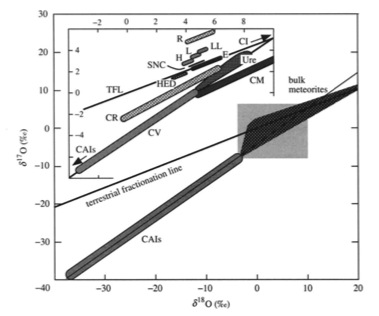
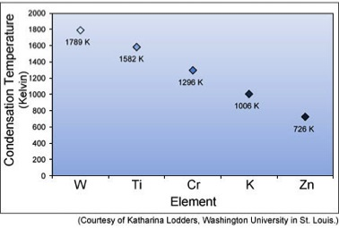
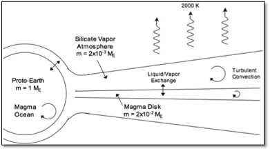

Background
==========

Geochemical characteristics of the Earth- Moon system:
------------------------------------------------------

Lunar samples returned from the Apollo program was a giant scientific leap, bringing first samples from 
a planetary body other than the Earth. These samples revealed important geochemical characteristics of 
the Moon. It has a lower density than the Earth and bulk chondrites compared to the Earth’s mantle. 
However bulk analysis of the lunar basalts show higher FeO content than terrestrial basalts. Moon is 
enriched in the refractory elements than the Earth’s mantle, however it has higher abundance of 
siderophile elements which is a signature of a smaller core than rocky planets of similar size. The moon 
also shows depletion in the volatile elements.

Isotopic composition of the moon plays a significant role in understanding the Moon formation event. 
Oxygen isotopic system is a very important tool in cosmochemistry. In a three isotopic plot (18O/16O Vs 
17O/16O), samples from a single planetary body define a line of slope ~0.5 that indicates fractionation 
processes taking place on the planet.  However due to initial heterogeneity in the solar system is also 
reflected in this isotopic system in a way that that different planetary bodies sampling different 
isotopic reservoir will define different line with slope ~0.5. As shown in figure 1, terrestrial 
fractionation line represents the Earth-Moon system. However parent bodies of meteorites define distinctly 
different lines suggesting that the early solar system was heterogeneous. But the fact that Earth-Moon 
system has identical oxygen isotopic composition (Franchi et al 2001) is puzzling and can have three 
different interpretations. The simplest one is that the impactor has a similar isotopic composition as 
the Earth, which is less likely. Or Moon is made up of Earth’s mantle. Dynamic simulations of the giant 
impact show that the Moon is made up of ~80% of Earth’s mantle (Canup et al., 2004). However Pahlevan and 
Stevenson 2007 show that contribution from the impactor as less as ~3% should reflect in isotopic 
heterogeneity in Earth- Moon system. Third possibility is that the mixing in proto-lunar disk was so 
profound that the system reached equilibrium and no heterogeneities could survive (Pahlevan and Stevenson 
2007). 

   
   Oxygen isotopic composition in the solar system (Franchi et al 2001)
   
   
Early solar system had a geochemical heterogeneity, however planetismals that formed in the same source 
region are expected to have similar chemical and isotopic composition. This is used as an explanation for 
identical oxygen isotopic composition of the Earth-Moon system. (eg. Franchi et al 2001) However planet 
formation process has three stages; Growth of dust grains into kilometer sized planetismals in the 
protoplanetary disk, which is followed by runaway growth into the Mars size planetismals. The feeding 
zone for runaway growth is ~0.01AU and this processes continues for a timespan of ~105-106 yr. The final 
stage of planet formation is though giant impact events. This is an extended stage of planetary 
accumulation that spans over a timescale of ~107-108 yr and involves significant of radial mixing. This 
process primarily dominated formation of the Earth, therefore sampling material from a much broader 
feeding zone. The composition of the Earth does not reflect the composition of the material at 1 AU in the
early solar system but has significant contribution from regions close to Mars and Mercury. Since Mars 
has a distinct isotopic composition (very different than the Earth, it provides a good probablility that 
the impactor that caused the Giant impact had a different isotopic composition. (Pahlevan and Stevenson, 
2007) 

  
   Trend in Condensation Temperature f the five elements (Taylor G. J. 2012)
   
 
With the advent of modern multi collector Inductively Coupled Plasma Mass Spectrometers, high precision 
isotopic analysis with high precision is made possible. Some recent studies of more refractory elements 
such as W (Touboul et al. 2007), Ti (Zang et al., 2012), Cr (Lugmair anf Shukolyukov 1998)) and K 
(Humayun and Clayton 1995) show that the isotopic composition of the Earth-Moon system is identical. 
However Zn isotopes show a distinct difference (Paniello et al 2012). As shown in figure 2, there is a 
trend in isotopic homogeneity or variation and temperature of condensation of the element. Elements 
with condensation temperature above ~1000K do not show any isotopic variation however Zn condenses 
~700K shows distinct difference in terrestrial and lunar samples. This has been interpreted as mass 
dependent isotopic fractionation effect during the proto-lunar disk evolution (Paneillo et al 2012).

   
   Schematic of proto-lunar disk immediately after the giant impact (Pahlevan and and Stevenson 2007)
   
As shown in figure 3, a proto-lunar disk consists of a central magmatic disk surrounded by the 
atmosphere. The atmosphere of the disk interacts with the atmosphere of the Earth allowing isotopic 
and volatile exchange. In order to understand the isotopic signatures in the Earth-Moon system, it is 
very essential to develop a simulation for the evolution of proto-lunar disk. Results from our research 
will provide significant insight into the isotopic mixing and volatile transport of the proto-lunar disk.

Model:
=====

Step 1: Setting up a magma disk and evolving it over time:
----------------------------------------------------------

The protolunar disk in our model contains a central disk composed of magma. We adopt disk evolution 
equation from Lynden-Bell and Pringle (1974), which defines changes in surface density,

.. math::
 \displaystyle \frac{\partial\Sigma}{\partial\text{t}} = \frac{1}{2\pi\text{r}} \frac{\partial\text{M}}{\partial\text{r}}

Where \sigma is surface density,
           t is time,
           r is radius of the disk, 
           M is accretion rate.
           
           Mass accretion rate through an annulus is 
           
.. math::
 \displaystyle \text{M} = 6 \pi\sqrt{r}  (\partial\sqrt{r}\Sigma\nu)
           
Where 
.. math::
 \nu 
is the turbulent viscosity of the disk.

This equation can be re-written as 
 
.. math::
 \displaystyle \text{M} = 3 \pi\Sigma\nu  (1 + 2Q)
 

.. math::
 \displaystyle \text{Q} = \frac{\partial\ln (\Sigma\nu)} {\partial\ln\text{r}}  
 
The figure shows the input window of our program that is being written in JAVA programming language. 
On the panel are the input parameters for initializing the proto-lunar disk.  The graph shows variation 
in the surface density with radius.
 
Step 2: Adding Temperature gradient to the Proto-Lunar disk:
------------------------------------------------------------
 
Adding temperature gradient, and hence change in the viscosity using following equation

.. math::
 \displaystyle \text{2}\sigma\text{T}^4 = \frac{9}{4} \Sigma\nu\Omega^2
 
Step 3: Adding atmosphere to the proto-Earth and the proto-Lunar disk:
----------------------------------------------------------------------
 
As shown in the figure, immediately after the giant impact, most of the Earth is in a molten state, 
surrounded by a circum-terrestrial proto-lunar disk made up of silicate magma. A common silicate- vapor 
atmosphere links the disk to the planet. This interaction (diffusive equilibrium) of disk atmosphere 
with the Earth’s atmosphere is a primary mechanism of exchange of volatiles and isotopes within the 
Earth-Moon system. (Pahleva and Stevenson 2007) It is suggested that hydrodynamic instabilities within 
the disk cause mixing of material up to ~ 1 yr after the giant impact, however after ~ 1yr Earth’s 
atmosphere gained enough angular momentum to match the angular velocity of the disk, which causes the 
instabilities to cease, which shuts down the mixing process. (Desch and Taylor 2013) 

Step 4: Adding tracer species (for volatile transport as well as Isotopic signatures):
--------------------------------------------------------------------------------------

In order to determine the time evolution of concentration of a species (either volatile species such as 
water, or an isotopic tracer), the mass accretion rate for this species is given as  

.. math::
  \displaystyle \text{M}_c = cM + 2 \pi\text{rD} \Sigma \frac{\partial\text{c}}{\partial\text{r}}
  
Where, concentration of the trace species 
.. math::
 \displaystyle c = \frac{\Sigma_c} {\Sigma} 
D is the diffusion coefficient of the species through the gas

         
